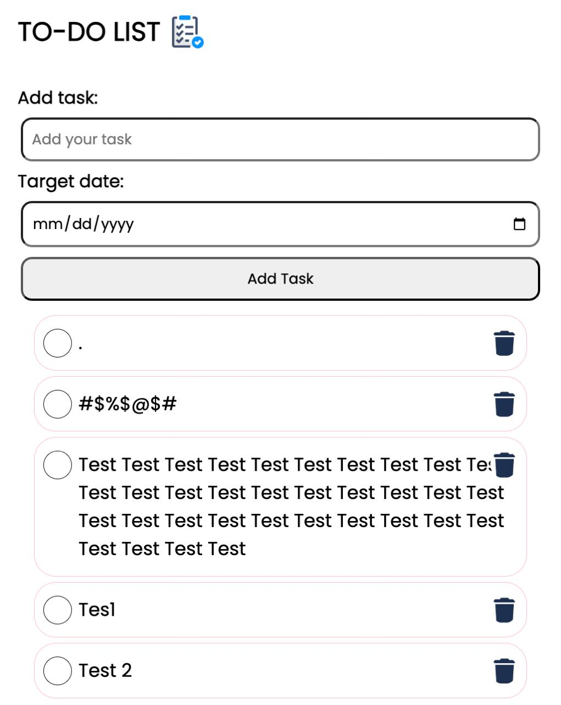

<div align="center">

# TO-DO List (Firebase + Auth)

Modern, secure to‑do web app with Firebase Authentication and Firestore. Users can register or sign in (Email/Password or Google), create tasks with due dates, mark them complete, and have their data securely stored per‑user in Firestore. The UI highlights overdue and completed tasks.



</div>

**Live Stack:** HTML/CSS/JS (vanilla) + Firebase Auth + Cloud Functions (Node.js) + Firestore

---

## Features

- Authentication: Email/Password and Google Sign‑In
- Per‑user data isolation in Firestore (`users/{uid}/todos/{todoId}`)
- Create, edit, toggle complete, and delete tasks
- Due dates, with visual cues:
  - Completed tasks turn green
  - Overdue tasks show a red border
- Mobile‑friendly responsive UI
- Secure API with ID token verification (Cloud Functions / Express)

## Architecture

- `public/` static frontend hosted via Firebase Hosting or Nginx (Docker)
- `functions/` backend using Firebase Cloud Functions (Node.js, Express‑style handlers)
- Firestore stores tasks under the authenticated user document
- Frontend calls backend with Firebase ID token (Authorization: Bearer)

```
Frontend (public)  →  Cloud Function API (functions)  →  Firestore (users/{uid}/todos)
           ↘  Firebase Auth (client SDK)  ↗  Admin SDK verifies ID token
```

## Tech Stack

- Frontend: HTML5, CSS3, JavaScript (ES modules)
- Auth: Firebase Authentication (Email/Password, Google)
- Backend: Firebase Cloud Functions (Node.js)
- Database: Cloud Firestore
- Optional: Docker (Nginx) for containerized frontend

## Project Structure

```
TO-DO_list_project/
├─ public/
│  ├─ index.html
│  ├─ login.html
│  ├─ register.html
│  ├─ style.css
│  └─ js/
│     ├─ script.js      # app logic (fetches API with ID token)
│     ├─ login.js       # sign‑in
│     └─ register.js    # sign‑up
├─ functions/
│  ├─ index.js          # Cloud Functions entry
│  ├─ routes/
│  │  └─ todoRoutes.js  # Todo CRUD handlers
│  └─ middleware/
│     └─ authenticate.js
├─ firebase.json
├─ firestore.rules
├─ firestore.indexes.json
└─ README.md
```

## Prerequisites

- Node.js 18+
- Firebase CLI: `npm i -g firebase-tools`
- A Firebase project (enable Authentication and Firestore)

## Local Development (Frontend only)

You can serve the frontend locally and still hit your deployed Cloud Functions API.

```powershell
cd d:\Webdev\TO-DO_list\TO-DO_list_project
firebase emulators:start --only hosting
```

Or use a simple static server (e.g., VS Code Live Server) from the `public/` folder. Ensure your frontend points to your deployed Functions URL.

## Backend: Cloud Functions

Initialize (if not already), install deps, and emulate or deploy:

```powershell
cd d:\Webdev\TO-DO_list\TO-DO_list_project\functions
npm install
firebase emulators:start --only functions
# or deploy
firebase deploy --only functions
```

## Firestore Security Rules

```js
rules_version = '2';
service cloud.firestore {
  match /databases/{database}/documents {
    match /users/{userId}/todos/{todoId} {
      allow read, write: if request.auth != null && request.auth.uid == userId;
    }
  }
}
```

Deploy rules:

```powershell
firebase deploy --only firestore:rules
```

## Firestore Indexes (example)

If Firestore suggests composite indexes in console logs, add them to `firestore.indexes.json` and deploy:

```powershell
firebase deploy --only firestore:indexes
```

## Environment & Configuration

- Client SDK config (apiKey, authDomain, etc.) is used on the frontend.
- Backend uses Firebase Admin SDK via Cloud Functions (no service account needed on Google Cloud). If self‑hosting Express, mount a service account JSON and set `GOOGLE_APPLICATION_CREDENTIALS`.

## Docker (Frontend Only)

Run the static frontend in a container while continuing to use your deployed Firebase backend.

Create `Dockerfile` in project root:

```dockerfile
FROM nginx:1.27-alpine
WORKDIR /usr/share/nginx/html
RUN rm -rf ./*
COPY public/ ./
RUN echo 'server { \
    listen 80; \
    server_name localhost; \
    root /usr/share/nginx/html; \
    index index.html; \
    location / { \
        try_files $uri $uri/ /index.html; \
    } \
}' > /etc/nginx/conf.d/default.conf
EXPOSE 80
CMD ["nginx","-g","daemon off;"]
```

Create `.dockerignore`:

```
functions
node_modules
.git
firebase.json
.firebaserc
firebase-debug.log
*.md
.env
serviceAccount.json
.firebase
```

Build and run:

```powershell
cd d:\Webdev\TO-DO_list\TO-DO_list_project
docker build -t todo-frontend .
docker run -p 8080:80 --name todo-app todo-frontend
```

Open http://localhost:8080

## Usage

1. Register or sign in (Email/Password or Google)
2. Add a task with a due date
3. Click a task to toggle completion (green when complete)
4. Overdue tasks show in red
5. Data persists per user in Firestore

## Security & Best Practices

- Enforce Firestore rules to restrict to `request.auth.uid == userId`
- Verify ID tokens on the backend for every request
- Prefer a single shared Firebase init on the frontend
- Consider server‑side validation (e.g., Joi) for task input
- Handle token refresh on 401 by retrying with `getIdToken(true)`

## Screenshots

The repository includes a sample screenshot: `WhatsApp Image 2025-03-22 at 00.23.04_f5b42dd4.jpg`.

## Roadmap / Possible Improvements

- Centralized `firebaseApp.js` for client init
- Enhanced validation and error reporting
- Inactivity auto‑logout
- Optional: Containerize backend (Express) and run full stack locally

## Author

- Built by Akash (GitHub: @Akashdevireddy09)


--> above is the image reprsesenting a simple todo list website hosted in the firebase with featutes like
1)logging into the page if user exist or else registering
1a)also logging the page via google popup authentication.
2)adding the tasks and target date to complete
3)toggling the tasks on completion byb clickig on the list item and the thing is the list item turns into green for completing the task,which i find  
somewhat cool thing to add.
4)If the task Overdues the target date ,the list item border turn into red indicating that you overdued the task.
5)The data of the every individual stores into the firestore database,which is responsible for saving your data even after logging out of the website.
6)You can get logout and login some other time with the same credentials and you are ready to visible your to do tasks.